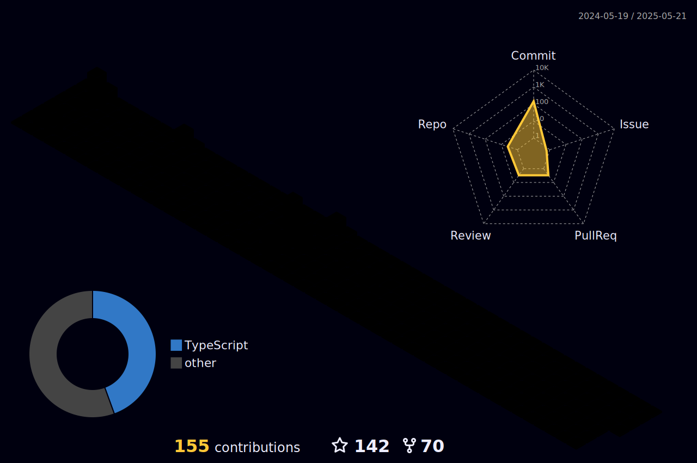

<h1 align="center">Olá 👋, eu sou o Rodrigo Almeida</h1>

Desenvolvedor de Software focado em back-end e front-end moderno, apaixonado por resolver problemas com código limpo e escalável.

---

---

### 📊 GitHub Stats

|  |  |
| ----------- | ----------- |

  

---

### 🏆 Conquistas GitHub

  

---

### 🧠 Atualmente aprendendo

- Docker & Kubernetes
- Microsserviços com Spring Cloud
- Testes com Jest e JUnit

---

### 🌱 Projetos em destaque

- ⚙️ **Plataforma de monitoramento Arduino**  
  Leitura e visualização de dados em tempo real via Node.js e Socket.io

---

### 📫 Contato

  
  

